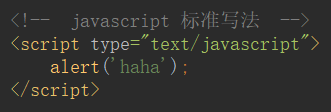

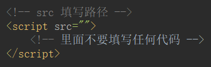

## 算数运算符

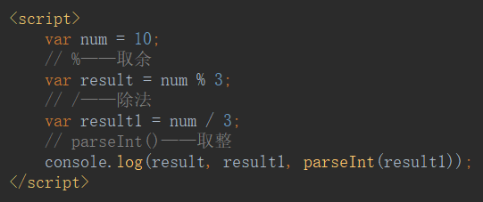

## ++ & --

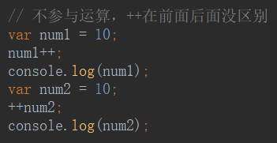

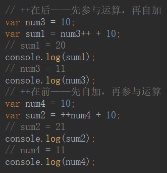

## 关系运算符

`==`——值一样

`===`——值和类型都得一样

## 逻辑运算符

`&&`——与

`||`——或

`！`——非

## 两个变量的值交换，使用位运算

只能是**数字**形式的值

python 也适用

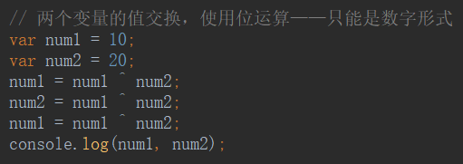

## 数据类型

`typeof()`——输出数据类型

null——空类型，是个**空对象**

undefined——未定义，①声明了，没有赋值。②函数没有明确返回值，还接收了。

NaN——不是一个数，由`undefined + number`而来

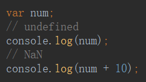

Number类型的最大值和最小值

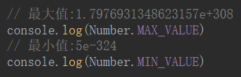

bug 不要拿小数去验证小数

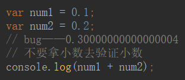

验证是不是 NaN ——`isNaN()`

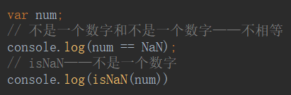

.length——长度

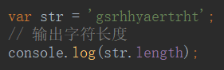

字符串的拼接

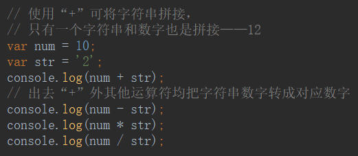

## 类型转换

### → 数字

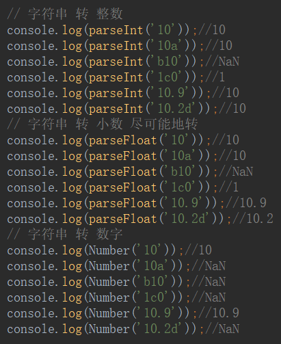

### → 字符串——`.toString()` ;`String()`

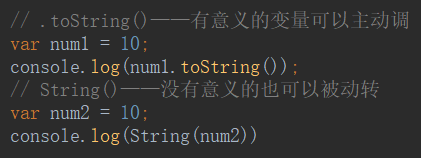

### →布尔

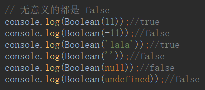

